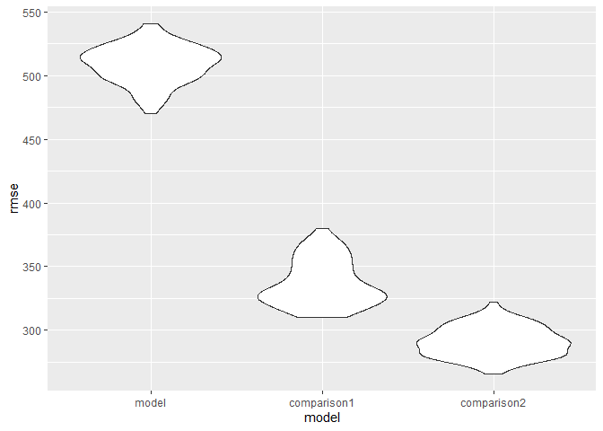

p8105_hw6_ss6692
================
Sanika Sule
\`r Sys.Date()

## HW 6

### Problem 2

``` r
library(tidyverse)
```

    ## Warning: package 'readr' was built under R version 4.3.2

    ## ── Attaching core tidyverse packages ──────────────────────── tidyverse 2.0.0 ──
    ## ✔ dplyr     1.1.3     ✔ readr     2.1.4
    ## ✔ forcats   1.0.0     ✔ stringr   1.5.0
    ## ✔ ggplot2   3.4.3     ✔ tibble    3.2.1
    ## ✔ lubridate 1.9.2     ✔ tidyr     1.3.0
    ## ✔ purrr     1.0.2     
    ## ── Conflicts ────────────────────────────────────────── tidyverse_conflicts() ──
    ## ✖ dplyr::filter() masks stats::filter()
    ## ✖ dplyr::lag()    masks stats::lag()
    ## ℹ Use the conflicted package (<http://conflicted.r-lib.org/>) to force all conflicts to become errors

``` r
library(dplyr)
library(p8105.datasets)
library(modelr)
library(mgcv)
```

    ## Loading required package: nlme
    ## 
    ## Attaching package: 'nlme'
    ## 
    ## The following object is masked from 'package:dplyr':
    ## 
    ##     collapse
    ## 
    ## This is mgcv 1.9-0. For overview type 'help("mgcv-package")'.

Downloading weather data.

``` r
weather_df = 
  rnoaa::meteo_pull_monitors(
    c("USW00094728"),
    var = c("PRCP", "TMIN", "TMAX"), 
    date_min = "2022-01-01",
    date_max = "2022-12-31") |>
  mutate(
    name = recode(id, USW00094728 = "CentralPark_NY"),
    tmin = tmin / 10,
    tmax = tmax / 10) |>
  select(name, id, everything())
```

    ## using cached file: C:\Users\sanik\AppData\Local/R/cache/R/rnoaa/noaa_ghcnd/USW00094728.dly

    ## date created (size, mb): 2023-09-28 10:23:24.948803 (8.541)

    ## file min/max dates: 1869-01-01 / 2023-09-30

``` r
boot_sample = function(df) {
  sample_df = df |> sample_frac(size = 1, replace = TRUE)
  model = lm(tmax ~ tmin + prcp, data = sample_df)

  # Getting r_squared values
  r_squared = broom::glance(model)[["r.squared"]]

  # Getting beta coefficients
  coef_df = broom::tidy(model)
  beta_tmin = coef_df |> filter(term == "tmin") |> pull(estimate)
  beta_prcp = coef_df |> filter(term == "prcp") |> pull(estimate)
  
# Because `βprcp` is a negative value. We expect `NaN` values for `log_beta`.
  
  # Calculating log of the product of beta_tmin and beta_prcp
  log_beta_product = log((beta_tmin) * (beta_prcp))

  # Creating a dataframe with both r_squared and log_beta_product
  return(data.frame(r_squared = r_squared, log_beta_product = log_beta_product))
}

boot_straps = 
  tibble(strap_number = 1:5000) |> 
  mutate(
    bootstrap_results = map(strap_number, ~ boot_sample(weather_df))
  ) |> 
  unnest(bootstrap_results)
```

    ## Warning: There were 3440 warnings in `mutate()`.
    ## The first warning was:
    ## ℹ In argument: `bootstrap_results = map(strap_number,
    ##   ~boot_sample(weather_df))`.
    ## Caused by warning in `log()`:
    ## ! NaNs produced
    ## ℹ Run `dplyr::last_dplyr_warnings()` to see the 3439 remaining warnings.

Distribution of r^2 values

``` r
boot_straps |> 
  ggplot(aes(x = r_squared)) + 
  geom_density()
```

<!-- -->

Distribution of `log(βprcp*βtmin)` values

``` r
boot_straps |> 
  ggplot(aes(x = log_beta_product)) + 
  geom_density()
```

    ## Warning: Removed 3440 rows containing non-finite values (`stat_density()`).

<!-- -->
There are `322 non-finite values`, which will not be included in the
`log(βprcp*βtmin)` plot.

### Problem 3

Cleaning birthweight data

``` r
birthweight =
  read_csv("data/birthweight.csv") |> 
  janitor::clean_names() |> 
  mutate(babysex = as.factor(babysex))
```

    ## Rows: 4342 Columns: 20
    ## ── Column specification ────────────────────────────────────────────────────────
    ## Delimiter: ","
    ## dbl (20): babysex, bhead, blength, bwt, delwt, fincome, frace, gaweeks, malf...
    ## 
    ## ℹ Use `spec()` to retrieve the full column specification for this data.
    ## ℹ Specify the column types or set `show_col_types = FALSE` to quiet this message.

For my proposed model, I will investigate the relationship between the
mother’s age at menarche `menarche` and the baby’s birth weight `bwt`.

``` r
menarche_bwt = 
  birthweight |> lm(bwt ~ menarche, data = _)
```

Plotting residuals using `add_predictions` and `add residuals`

``` r
birthweight |> 
  modelr::add_predictions(menarche_bwt) |> 
  modelr::add_residuals(menarche_bwt) |> 
  ggplot(aes(x = pred, y = resid)) + 
  geom_point() + 
  labs(title = "Residuals vs. Fitted Values",
       x = "Fitted Values",
       y = "Residuals")
```

<!-- -->

Creating models to compare my model to.

``` r
comparison_1 = 
  birthweight |> 
  lm(bwt ~ blength + gaweeks, data = _)

comparison_2 = 
  birthweight |> 
  lm(bwt ~ babysex*bhead*blength, data = _)
```

Comparing my model to the two comparison models.

``` r
birthweight |> 
  gather_predictions(menarche_bwt, comparison_1, comparison_2) |> 
  mutate(model = fct_inorder(model)) |> 
  ggplot(aes(x = blength, y = bwt)) + 
  geom_point(alpha = .5) +
  geom_line(aes(y = pred), color = "red") + 
  facet_grid(~model)
```

<!-- -->

Comparing using `crossv_mc`

``` r
cv_data =
  crossv_mc(birthweight, 100) |> 
  mutate(
    train = map(train, as_tibble),
    test = map(test, as_tibble))
```

RMSE value distribution for the two candidate models.

``` r
cv_data = 
  cv_data |> 
  mutate(
    model_mod  = map(train, \(df) lm(bwt ~ menarche, data = df)),
    comparison_1     = map(train, \(df) lm(bwt ~ blength + gaweeks, data = df)),
    comparison_2  = map(train, \(df) lm(bwt ~ babysex*bhead*blength, data = df))) |> 
  mutate(
    rmse_model = map2_dbl(model_mod, test, \(mod, df) rmse(model = mod, data = df)),
    rmse_comparison1    = map2_dbl(comparison_1, test, \(mod, df) rmse(model = mod, data = df)),
    rmse_comparison2 = map2_dbl(comparison_2, test, \(mod, df) rmse(model = mod, data = df)))
```

Plotting RMSE values for the proposed model and two comparison models

``` r
cv_data |> 
  select(starts_with("rmse")) |> 
  pivot_longer(
    everything(),
    names_to = "model", 
    values_to = "rmse",
    names_prefix = "rmse_") |> 
  mutate(model = fct_inorder(model)) |> 
  ggplot(aes(x = model, y = rmse)) + geom_violin()
```

<!-- -->

The comparison 2 distribution shows the lowest RMSE values, and
therefore has the best predictive ability.The proposed model has very
high RMSE values, indicating that mother’s age at menarche has low
predictive accuracy about baby’s birth weight.
