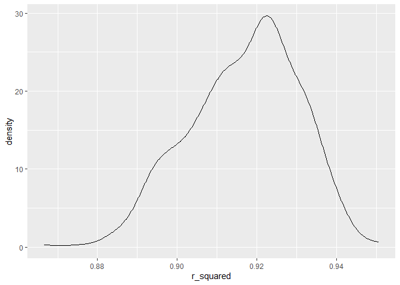

p8105_hw6_ss6692
================
Sanika Sule
2023-12-02

### Problem 2

``` r
library(tidyverse)
```

    ## Warning: package 'readr' was built under R version 4.3.2

    ## ── Attaching core tidyverse packages ──────────────────────── tidyverse 2.0.0 ──
    ## ✔ dplyr     1.1.3     ✔ readr     2.1.4
    ## ✔ forcats   1.0.0     ✔ stringr   1.5.0
    ## ✔ ggplot2   3.4.3     ✔ tibble    3.2.1
    ## ✔ lubridate 1.9.2     ✔ tidyr     1.3.0
    ## ✔ purrr     1.0.2     
    ## ── Conflicts ────────────────────────────────────────── tidyverse_conflicts() ──
    ## ✖ dplyr::filter() masks stats::filter()
    ## ✖ dplyr::lag()    masks stats::lag()
    ## ℹ Use the conflicted package (<http://conflicted.r-lib.org/>) to force all conflicts to become errors

``` r
library(dplyr)
library(p8105.datasets)
library(modelr)
library(mgcv)
```

    ## Loading required package: nlme
    ## 
    ## Attaching package: 'nlme'
    ## 
    ## The following object is masked from 'package:dplyr':
    ## 
    ##     collapse
    ## 
    ## This is mgcv 1.9-0. For overview type 'help("mgcv-package")'.

``` r
weather_df = 
  rnoaa::meteo_pull_monitors(
    c("USW00094728"),
    var = c("PRCP", "TMIN", "TMAX"), 
    date_min = "2022-01-01",
    date_max = "2022-12-31") |>
  mutate(
    name = recode(id, USW00094728 = "CentralPark_NY"),
    tmin = tmin / 10,
    tmax = tmax / 10) |>
  select(name, id, everything())
```

    ## using cached file: C:\Users\sanik\AppData\Local/R/cache/R/rnoaa/noaa_ghcnd/USW00094728.dly

    ## date created (size, mb): 2023-09-28 10:23:24.948803 (8.541)

    ## file min/max dates: 1869-01-01 / 2023-09-30

``` r
weather_model = lm(data = weather_df, tmax ~ tmin + prcp) 
  model_r = broom::glance(weather_model)|>
  select(r.squared)
tibble(model_r)
```

    ## # A tibble: 1 × 1
    ##   r.squared
    ##       <dbl>
    ## 1     0.916

``` r
r_squared = model_r[["r.squared"]]
weather_df = 
  weather_df|> 
  mutate (r_squared = r_squared)

summary(weather_model)
```

    ## 
    ## Call:
    ## lm(formula = tmax ~ tmin + prcp, data = weather_df)
    ## 
    ## Residuals:
    ##     Min      1Q  Median      3Q     Max 
    ## -6.3705 -1.9950 -0.0249  1.4974 20.4503 
    ## 
    ## Coefficients:
    ##              Estimate Std. Error t value Pr(>|t|)    
    ## (Intercept)  8.042803   0.230065  34.959   <2e-16 ***
    ## tmin         1.013386   0.016154  62.734   <2e-16 ***
    ## prcp        -0.001541   0.002103  -0.733    0.464    
    ## ---
    ## Signif. codes:  0 '***' 0.001 '**' 0.01 '*' 0.05 '.' 0.1 ' ' 1
    ## 
    ## Residual standard error: 2.956 on 362 degrees of freedom
    ## Multiple R-squared:  0.916,  Adjusted R-squared:  0.9155 
    ## F-statistic:  1972 on 2 and 362 DF,  p-value: < 2.2e-16

``` r
model_coef = broom::tidy(weather_model)

beta_tmin = model_coef |> filter(term == "tmin") |> pull(estimate)
beta_prcp = model_coef |> filter(term == "prcp") |> pull(estimate)

model_coef =
model_coef|>
  mutate(log(beta_tmin * beta_prcp), NA)
```

    ## Warning: There was 1 warning in `mutate()`.
    ## ℹ In argument: `log(beta_tmin * beta_prcp)`.
    ## Caused by warning in `log()`:
    ## ! NaNs produced

Because `βprcp` is a negative value. We expect `NaN` values for
`log_beta`.

``` r
boot_sample = function(df) {
  sample_frac(df, replace = TRUE)
  
model_r = data |>
  select(r_squared)
model_coef |>
  select(log)
tibble(
  model_r,
  model_coef
)
}
```

``` r
boot_sample = function(df) {
  sample_df = df |> sample_frac(size = 1, replace = TRUE)
  model = lm(tmax ~ tmin + prcp, data = sample_df)
  r_squared = broom::glance(model)[["r.squared"]]
  return(data.frame(r_squared = r_squared))
}

boot_straps = 
  tibble(strap_number = 1:500) |> 
  mutate(
    bootstrap_results = map(strap_number, ~boot_sample(weather_df))
  ) |> 
  unnest(bootstrap_results)
```

``` r
boot_straps |> 
  ggplot(aes(x = r_squared)) + 
  geom_density()
```

<!-- -->
