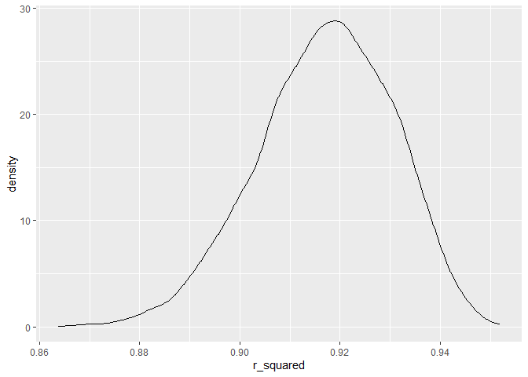
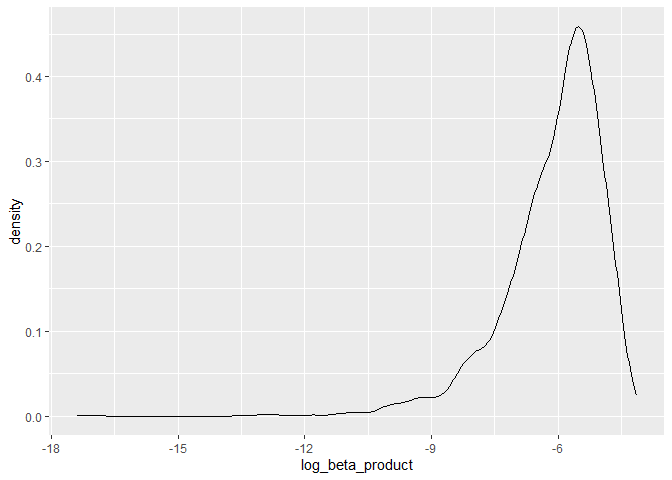

p8105_hw6_ss6692
================
Sanika Sule
2023-12-02

### Problem 2

``` r
library(tidyverse)
```

    ## Warning: package 'readr' was built under R version 4.3.2

    ## ── Attaching core tidyverse packages ──────────────────────── tidyverse 2.0.0 ──
    ## ✔ dplyr     1.1.3     ✔ readr     2.1.4
    ## ✔ forcats   1.0.0     ✔ stringr   1.5.0
    ## ✔ ggplot2   3.4.3     ✔ tibble    3.2.1
    ## ✔ lubridate 1.9.2     ✔ tidyr     1.3.0
    ## ✔ purrr     1.0.2     
    ## ── Conflicts ────────────────────────────────────────── tidyverse_conflicts() ──
    ## ✖ dplyr::filter() masks stats::filter()
    ## ✖ dplyr::lag()    masks stats::lag()
    ## ℹ Use the conflicted package (<http://conflicted.r-lib.org/>) to force all conflicts to become errors

``` r
library(dplyr)
library(p8105.datasets)
library(modelr)
library(mgcv)
```

    ## Loading required package: nlme
    ## 
    ## Attaching package: 'nlme'
    ## 
    ## The following object is masked from 'package:dplyr':
    ## 
    ##     collapse
    ## 
    ## This is mgcv 1.9-0. For overview type 'help("mgcv-package")'.

``` r
weather_df = 
  rnoaa::meteo_pull_monitors(
    c("USW00094728"),
    var = c("PRCP", "TMIN", "TMAX"), 
    date_min = "2022-01-01",
    date_max = "2022-12-31") |>
  mutate(
    name = recode(id, USW00094728 = "CentralPark_NY"),
    tmin = tmin / 10,
    tmax = tmax / 10) |>
  select(name, id, everything())
```

    ## using cached file: C:\Users\sanik\AppData\Local/R/cache/R/rnoaa/noaa_ghcnd/USW00094728.dly

    ## date created (size, mb): 2023-09-28 10:23:24.948803 (8.541)

    ## file min/max dates: 1869-01-01 / 2023-09-30

``` r
boot_sample = function(df) {
  sample_df = df |> sample_frac(size = 1, replace = TRUE)
  model = lm(tmax ~ tmin + prcp, data = sample_df)

  # Getting r_squared values
  r_squared = broom::glance(model)[["r.squared"]]

  # Getting beta coefficients
  coef_df = broom::tidy(model)
  beta_tmin = coef_df |> filter(term == "tmin") |> pull(estimate)
  beta_prcp = coef_df |> filter(term == "prcp") |> pull(estimate)
  
# Because `βprcp` is a negative value. We expect `NaN` values for `log_beta`.
  
  # Calculating log of the product of beta_tmin and beta_prcp
  log_beta_product = log((beta_tmin) * (beta_prcp))

  # Creating a dataframe with both r_squared and log_beta_product
  return(data.frame(r_squared = r_squared, log_beta_product = log_beta_product))
}

boot_straps = 
  tibble(strap_number = 1:500) |> 
  mutate(
    bootstrap_results = map(strap_number, ~boot_sample(weather_df))
  ) |> 
  unnest(bootstrap_results)
```

    ## Warning: There were 331 warnings in `mutate()`.
    ## The first warning was:
    ## ℹ In argument: `bootstrap_results = map(strap_number,
    ##   ~boot_sample(weather_df))`.
    ## Caused by warning in `log()`:
    ## ! NaNs produced
    ## ℹ Run `dplyr::last_dplyr_warnings()` to see the 330 remaining warnings.

``` r
boot_straps |> 
  ggplot(aes(x = r_squared)) + 
  geom_density()
```

<!-- -->

``` r
boot_straps |> 
  ggplot(aes(x = log_beta_product)) + 
  geom_density()
```

    ## Warning: Removed 331 rows containing non-finite values (`stat_density()`).

<!-- -->
